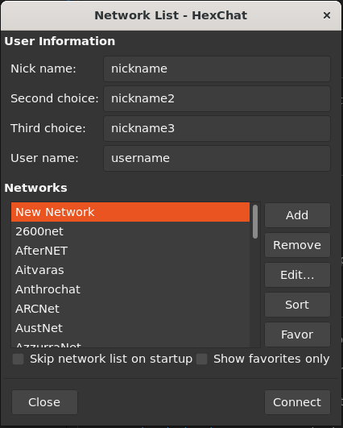

*This project has been created as part
of the 42 curriculum by jhubier, jodone and mgarnier.*

# <h1 align="center">
ft_irc</h1>

# Description

This project is to create a server while the purpose is to allow a text-based chat with the Internet Relay Chat (IRC) protocol.

# Instructions

`make`

`./ircserv <port> <password>`

Launch Hexchat and connect with the ip of the server.

# Resources

We found the majority of our informations with this sources:

[beej.us](https://beej.us/guide/bgnet/pdf/bgnet_usl_c_1.pdf) -> explanations of differents functions (socket, bind, poll, accept, recv, send, ...)

[frameip.com](https://www.frameip.com/c-mode-connecte/?video=346#video-346) -> protocol between client and server and a minimalist example in C++

[modern.ircdocs.horse](https://modern.ircdocs.horse/#rplwelcome-001) -> communication between client and server with RPL

# AI

ChatGPT -> provide us some explanations and examples with new concepts.

Copilot -> help us to set the right syntax with new functions
